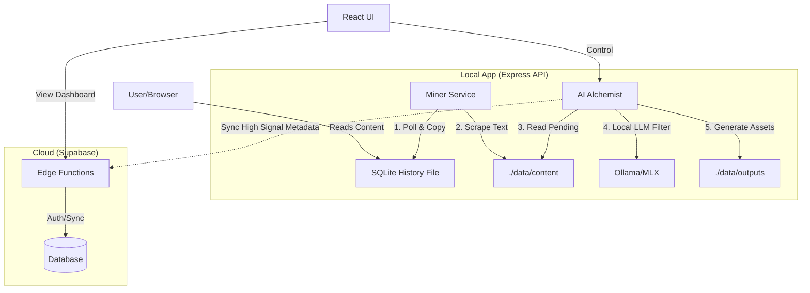

This specification strictly adheres to the **Email Automator** system design pattern, utilizing the Hybrid Architecture (Supabase Edge + Local Express API) to ensure privacy, performance, and seamless deployment within the RealTimeX ecosystem.

---

# RealTimeX Alchemy - PDR & Technical Spec

## 1. Product Definition Reference (PDR)

### Executive Summary
**RealTimeX Alchemy** is a "Passive Intelligence" engine. It is a local-first application that runs in the background, mining the user's web browsing history to extract high-value insights. It uses a Local LLM to filter noise and "transmute" raw reading habits into monetizable content assets (Newsletters, Market Reports, Social Threads) without active user effort.

### Core Value Proposition
*   **Zero-Friction:** Users do not highlight or save. They just read.
*   **Privacy-First:** Raw browsing history never leaves the local machine.
*   **Monetization:** Turns 4 hours of reading into a sellable product automatically.

---

## 2. Technical Specification

## Overview
Alchemy uses a **hybrid architecture** identical to Email Automator. It combines Supabase Edge Functions for user management and configuration with a Local Express API for heavy data mining and AI processing.

## User Setup (Automated)
Users provide:
- **Supabase Project URL**
- **Supabase Publishable/Anon Key**

The application detects uninitialized databases and triggers the **Automated Setup**.
*   **The Migration Engine:** The `scripts/migrate.sh` script (bundled in NPM) executes:
    1.  Links the remote Supabase project.
    2.  Applies SQL migrations (Schema for `signals`, `personas`, `outputs`).
    3.  Deploys Edge Functions.
    4.  Pushes configuration.
*   **Portability:** Uses the bundled Supabase CLI in `node_modules/.bin` to ensure it works in RealTimeX sandboxes.

## Architecture Components



## Data Flow: Async ETL Pipeline

Alchemy uses an **Extract, Transform, Load (ETL)** pattern optimized for browsing history:

1.  **Extract (The Miner)**:
    *   The Local Express API polls the browser's `History` SQLite file (Chrome/Edge/Brave) every 30 minutes.
    *   **Crucial Step:** It creates a temporary copy of the SQLite file to bypass browser file locks.
    *   It filters URLs via Regex (ignoring `localhost`, `google.com`, etc.).

2.  **Transform (Storage)**:
    *   Raw article text is scraped and saved as `.md` (Markdown) files on local disk (default: `./data/content`).
    *   Basic metadata (URL, Title, Timestamp, Domain) is synced to the Supabase Database (`signals` table) with a status of `PENDING`.

3.  **Load (The Transmutation)**:
    *   A background worker picks up `PENDING` signals.
    *   **The Filter:** It feeds the text to a Local LLM with a "Signal Score" prompt.
    *   **Decision:**
        *   *Low Signal:* Mark as `IGNORED`. Delete local `.md` file to save space.
        *   *High Signal:* Mark as `PROCESSED`. Update DB with the "Gist/Summary." Trigger the "Generator" to update the daily draft.

## Component Responsibilities

### Edge Functions (Serverless)
*   **User Management:** Auth & Profile.
*   **Persona Storage:** Storing the "Voice" settings (e.g., "Cynical Investor", "Hype-Man").
*   **Marketplace logic:** Validating subscription tiers (Free vs Pro).
*   **Sync Endpoint:** Receiving metadata updates from the Local App.

### Express API (Local App / Background Worker)
*   **File System Access:** Reading the restricted `AppData`/`Library` folders to find Browser History.
*   **Scraping Engine:** Headless browser or Fetch API to turn URLs into Text.
*   **Local AI Interface:** Managing the connection to the Local LLM (Ollama) for the heavy lifting (Filtering).
*   **Asset Generation:** Writing the final Newsletter/Thread to `./data/outputs`.
*   **Live Terminal:** Emitting logs via Supabase Realtime ("Scraping Bloomberg...", "Signal Found!").

## Database Schema (Simplified)

*   `personas`: Stores the writing style prompt.
*   `signals`:
    *   `id`: uuid
    *   `url`: text
    *   `domain`: text
    *   `title`: text
    *   `signal_score`: int (0-100)
    *   `summary`: text (AI generated)
    *   `status`: enum (PENDING, PROCESSED, IGNORED)
*   `outputs`:
    *   `id`: uuid
    *   `type`: enum (NEWSLETTER, THREAD, REPORT)
    *   `content`: text (Markdown)

## Local App Portability

*   **Sandbox Friendly:** If the default Browser History path is inaccessible (due to OS permissions), the app prompts the user to manually select the `History` file or upload an exported JSON, falling back to `./data` for all operations.
*   **Self-Healing:** Automatically refreshes Supabase sessions and re-connects to the Local LLM if the service drops.

## Deployment Commands

```bash
# 1. Setup Backend (Migrations + Edge Functions)
./scripts/migrate.sh

# 2. Start the Alchemist (Express API + Miner)
npm run dev:api

# 3. Start the UI
npm run dev
```

## Security & Privacy Strategy
1.  **Local-First Scraping:** We do not use third-party scraping APIs. The Express API fetches content directly from the user's IP, which helps bypass some bot detection and keeps data local.
2.  **Raw Data Isolation:** The full text of the articles *never* leaves the `./data/content` folder. Only the *synthesized summary* is sent to Supabase (if cloud sync is enabled).
3.  **Credential Management:** OpenAI/Anthropic keys (if used for the final polish) are stored in Supabase Vault and accessed only via Edge Functions, or stored locally in `.env` if using the purely local mode.