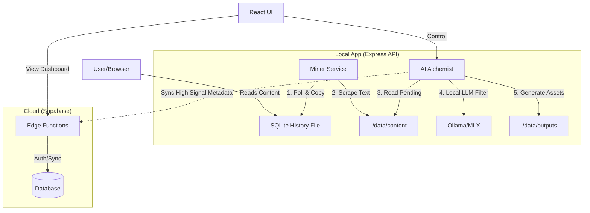

│  Session ID:                 b4ef442f-0c6d-4fdd-ac41-df46c9a03bc8                                          │
│  Tool Calls:                 0 ( ✓ 0 x 0 )                                                                 │
│  Success Rate:               0.0%                                                                          │
│                                                                                                            │
│  Performance                                                                                               │
│  Wall Time:                  26.7s                                                                         │
│  Agent Active:               0s                                                                            │
│    » API Time:               0s (0.0%)                                                                     │
│    » Tool Time:              0s (0.0%)                                                                     │
│                                                                                                            │
│                                                                                                            │
╰────────────────────────────────────────────────────────────────────────────────────────────────────────────╯
(base) ledangtrung@Les-MacBook-Air realtimex-alchemy % clear
(base) ledangtrung@Les-MacBook-Air realtimex-alchemy % gemini

   ░░░            ░░░░░░░░░  ░░░░░░░░░░ ░░░░░░   ░░░░░░ ░░░░░ ░░░░░░   ░░░░░ ░░░░░
     ░░░         ░░░     ░░░ ░░░        ░░░░░░   ░░░░░░  ░░░  ░░░░░░   ░░░░░  ░░░
       ░░░      ░░░          ░░░        ░░░ ░░░ ░░░ ░░░  ░░░  ░░░ ░░░  ░░░    ░░░
 ███     ░░░    █████████░░██████████ ██████ ░░██████░█████░██████ ░░█████ █████░
   ███ ░░░     ███░    ███░███░░      ██████  ░██████░░███░░██████  ░█████  ███░░
     ███      ███░░░     ░░███░░      ███░███ ███ ███░░███░░███░███  ███░░  ███░░
   ░░░ ███    ███ ░░░█████░██████░░░░░███░░█████  ███░░███░░███░░███ ███░░░ ███░░░
     ███      ███      ███ ███        ███   ███   ███  ███  ███   ██████    ███
   ███         ███     ███ ███        ███         ███  ███  ███    █████    ███
 ███            █████████  ██████████ ███         ███ █████ ███     █████  █████

Tips for getting started:
1. Ask questions, edit files, or run commands.
2. Be specific for the best results.
3. /help for more information.

> /auth login


ℹ Code Assist login required.
  Attempting to open authentication page in your browser.
  Otherwise navigate to:
  https://accounts.google.com/o/oauth2/v2/auth?redirect_uri=http%3A%2F%2Flocalhost%3A51304%2Foauth2callback&ac
  ess_type=offline&scope=https%3A%2F%2Fwww.googleapis.com%2Fauth%2Fcloud-platform%20https%3A%2F%2Fwww.googleap
  s.com%2Fauth%2Fuserinfo.email%20https%3A%2F%2Fwww.googleapis.com%2Fauth%2Fuserinfo.profile&state=52ad364bdef
  d5dd89fc35b7d74509eb2fb4d88b387658e673d38d825bff7046&response_type=code&client_id=681255809395-oo8ft2oprdrnp
  e3aqf6av3hmdib135j.apps.googleusercontent.com

ℹ Waiting for authentication...

ℹ Authentication succeeded
╭────────────────────────────────────────────────────────────────────────────────────────────────────────────╮
│ You have successfully logged in with Google. Gemini CLI needs to be restarted. Press 'r' to restart, or    │
│ 'escape' to choose a different auth method.                                                                │
╰────────────────────────────────────────────────────────────────────────────────────────────────────────────╯

   ░░░            ░░░░░░░░░  ░░░░░░░░░░ ░░░░░░   ░░░░░░ ░░░░░ ░░░░░░   ░░░░░ ░░░░░
     ░░░         ░░░     ░░░ ░░░        ░░░░░░   ░░░░░░  ░░░  ░░░░░░   ░░░░░  ░░░
       ░░░      ░░░          ░░░        ░░░ ░░░ ░░░ ░░░  ░░░  ░░░ ░░░  ░░░    ░░░
 ███     ░░░    █████████░░██████████ ██████ ░░██████░█████░██████ ░░█████ █████░
   ███ ░░░     ███░    ███░███░░      ██████  ░██████░░███░░██████  ░█████  ███░░
     ███      ███░░░     ░░███░░      ███░███ ███ ███░░███░░███░███  ███░░  ███░░
   ░░░ ███    ███ ░░░█████░██████░░░░░███░░█████  ███░░███░░███░░███ ███░░░ ███░░░
     ███      ███      ███ ███        ███   ███   ███  ███  ███   ██████    ███
   ███         ███     ███ ███        ███         ███  ███  ███    █████    ███
 ███            █████████  ██████████ ███         ███ █████ ███     █████  █████

Tips for getting started:
1. Ask questions, edit files, or run commands.
2. Be specific for the best results.
3. /help for more information.

> /stats session

╭────────────────────────────────────────────────────────────────────────────────────────────────────────────╮
│                                                                                                            │
│  Session Stats                                                                                             │
│                                                                                                            │
│  Interaction Summary                                                                                       │
│  Session ID:                 02f06079-59d2-4763-b7ed-8a322085a44e                                          │
│  Tool Calls:                 0 ( ✓ 0 x 0 )                                                                 │
│  Success Rate:               0.0%                                                                          │
│                                                                                                            │
│  Performance                                                                                               │
│  Wall Time:                  8.1s                                                                          │
│  Agent Active:               0s                                                                            │
│    » API Time:               0s (0.0%)                                                                     │
│    » Tool Time:              0s (0.0%)                                                                     │
│                                                                                                            │
│                                                                                                            │
│  Model Usage                 Reqs                  Usage left                                              │
│  ────────────────────────────────────────────────────────────                                              │
│  gemini-2.5-flash               -      100.0% (Resets in 24h)                                              │
│  gemini-2.5-flash-lite          -      100.0% (Resets in 24h)                                              │
│  gemini-2.5-pro                 -      100.0% (Resets in 24h)                                              │
│  gemini-3-flash-preview         -      100.0% (Resets in 24h)                                              │
│  gemini-3-pro-preview           -      100.0% (Resets in 24h)                                              │
│                                                                                                            │
│  Usage limits span all sessions and reset daily.                                                           │
│  /auth to upgrade or switch to API key.                                                                    │
│                                                                                                            │
│                                                                                                            │
│  » Tip: For a full token breakdown, run `/stats model`.                                                    │
│                                                                                                            │
╰────────────────────────────────────────────────────────────────────────────────────────────────────────────╯

> /about


╭────────────────────────────────────────────────────────────────────────────────────────────────────────────╮
│                                                                                                            │
│ About Gemini CLI                                                                                           │
│                                                                                                            │
│ CLI Version                          0.25.0                                                                │
│ Git Commit                           eb8834341                                                             │
│ Model                                auto-gemini-3                                                         │
│ Sandbox                              no sandbox                                                            │
│ OS                                   darwin                                                                │
│ Auth Method                          OAuth                                                                 │
│ User Email                           trungdangle@gmail.com                                                 │
│ IDE Client                           Antigravity                                                           │
│                                                                                                            │
╰────────────────────────────────────────────────────────────────────────────────────────────────────────────╯


> /model


> deep review implementation of realtimex-alchemy


ℹ Request cancelled.

> deep review implementation of realtimex-alchemy


ℹ Request cancelled.

> /model


> /auth login


ℹ Code Assist login required.
  Attempting to open authentication page in your browser.
  Otherwise navigate to:
  https://accounts.google.com/o/oauth2/v2/auth?redirect_uri=http%3A%2F%2Flocalhost%3A53926%2Foauth2callback&ac
  ess_type=offline&scope=https%3A%2F%2Fwww.googleapis.com%2Fauth%2Fcloud-platform%20https%3A%2F%2Fwww.googleap
  s.com%2Fauth%2Fuserinfo.email%20https%3A%2F%2Fwww.googleapis.com%2Fauth%2Fuserinfo.profile&state=0d6866ceca2
  f664b7ec85bd20ca9dd5b3181dfdf63593f1d5c1ccfe48006b60&response_type=code&client_id=681255809395-oo8ft2oprdrnp
  e3aqf6av3hmdib135j.apps.googleusercontent.com

ℹ Waiting for authentication...

ℹ Authentication succeeded
╭────────────────────────────────────────────────────────────────────────────────────────────────────────────╮
│ You have successfully logged in with Google. Gemini CLI needs to be restarted. Press 'r' to restart, or    │
│ 'escape' to choose a different auth method.                                                                │
╰────────────────────────────────────────────────────────────────────────────────────────────────────────────╯
r
   ░░░            ░░░░░░░░░  ░░░░░░░░░░ ░░░░░░   ░░░░░░ ░░░░░ ░░░░░░   ░░░░░ ░░░░░
     ░░░         ░░░     ░░░ ░░░        ░░░░░░   ░░░░░░  ░░░  ░░░░░░   ░░░░░  ░░░
       ░░░      ░░░          ░░░        ░░░ ░░░ ░░░ ░░░  ░░░  ░░░ ░░░  ░░░    ░░░
 ███     ░░░    █████████░░██████████ ██████ ░░██████░█████░██████ ░░█████ █████░
   ███ ░░░     ███░    ███░███░░      ██████  ░██████░░███░░██████  ░█████  ███░░
     ███      ███░░░     ░░███░░      ███░███ ███ ███░░███░░███░███  ███░░  ███░░
   ░░░ ███    ███ ░░░█████░██████░░░░░███░░█████  ███░░███░░███░░███ ███░░░ ███░░░
     ███      ███      ███ ███        ███   ███   ███  ███  ███   ██████    ███
   ███         ███     ███ ███        ███         ███  ███  ███    █████    ███
 ███            █████████  ██████████ ███         ███ █████ ███     █████  █████

Tips for getting started:
1. Ask questions, edit files, or run commands.
2. Be specific for the best results.
3. /help for more information.

> deep review implementation of realtimex-alchemy


ℹ Request cancelled.

> deep review implementation of realtimex-alchemy

╭────────────────────────────────────────────────────────────────────────────────────────────────────────────╮
│ ✓  Delegate to Agent Delegating to agent 'codebase_investigator'                                           │
│                                                                                                            │
│ Subagent codebase_investigator Finished                                                                    │
│                                                                                                            │
│ Termination Reason:                                                                                        │
│  GOAL                                                                                                      │
│                                                                                                            │
│ Result:                                                                                                    │
│ {                                                                                                          │
│   "SummaryOfFindings": "The realtimex-alchemy codebase implements a local-first intelligence gathering     │
│ system. It extracts browser history, processes it using LLMs, and provides real-time feedback.\n\n###      │
│ Architectural Overview\n- Hybrid Real-time: Uses SSE for immediate local logs and Supabase Postgres CDC    │
│ for persistent, multi-device event streaming.\n- BYOK (Bring Your Own Key): Designed to use user-provided  │
│ Supabase and LLM credentials, stored in the alchemy_settings table.\n- Local-Cloud Bridge: The API runs    │
│ locally (accessing local files) but persists results to a cloud-based Supabase instance.\n\n### Key        │
│ Flows\n1. Mining: MinerService copies local SQLite files (to avoid locks), queries them for new URLs based │
│ on history_checkpoints, and filters against a blacklist.\n2. Analysis: AlchemistService iterates through   │
│ history. Crucially, content scraping is currently simulated. It uses OpenAI-compatible APIs (local Ollama  │
│ or remote OpenAI) with a specific prompt to score relevance (0-100) and extract entities.\n3. Storage:     │
│ Relevant 'Signals' are saved to the signals table for UI discovery.\n\n### Structural Weaknesses &         │
│ Risks\n1. Scraping Gap: The AlchemistService currently uses simulated content (Page Title + URL). A real   │
│ implementation requires a robust scraping library (e.g., Playwright or a simpler HTTP fetcher with         │
│ Readability.js).\n2. Security & Auth: The getAuthenticatedSupabase helper trusts headers for               │
│ configuration. While suitable for local usage, it requires strict origin/CORS management if exposed.\n3.   │
│ Browser Support: Safari support is noted as complex/skipped in MinerService. Edge/Chrome/Brave are handled │
│ better but rely on standard path assumptions.\n4. Data Normalization: Timestamps in browser SQLite         │
│ databases (WebKit vs Unix) are not fully normalized, which could lead to checkpointing issues across       │
│ different browsers.\n5. Redundancy: Logging via both SSE and Supabase Realtime adds complexity. While SSE  │
│ is great for local-only, relying on Supabase Realtime for the 'Live Terminal' is more consistent with the  │
│ rest of the app's state management.\n\n### Recommendations\n- Implement Real Scraping: Replace simulated   │
│ content in AlchemistService with actual page text extraction.\n- Improve Error Resilience: Add better      │
│ handling for SQLite file access errors (e.g., permissions on macOS).\n- Refine Checkpointing: Normalize    │
│ all browser timestamps to a standard format (Unix ms) before storing in history_checkpoints.\n- UI/UX:     │
│ Provide better feedback in the UI when the local API is unreachable or when LLM configurations fail.",     │
│   "ExplorationTrace": [                                                                                    │
│     "Analyzed api/index.ts to understand the Express server setup and endpoint structure.",                │
│     "Examined src/App.tsx to see the frontend entry point and how it interacts with the backend and        │
│ Supabase.",                                                                                                │
│     "Investigated MinerService.ts for browser history extraction logic, including the SQLite copying       │
│ mechanism.",                                                                                               │
│     "Analyzed AlchemistService.ts to understand the LLM integration and the (currently simulated) scraping │
│ process.",                                                                                                 │
│     "Reviewed LibrarianService.ts and ProcessingEventService.ts for data persistence and real-time event   │
│ logging.",                                                                                                 │
│     "Checked Supabase migrations to understand the database schema (signals, settings, checkpoints,        │
│ processing_events).",                                                                                      │
│     "Reviewed AlchemistEngine.tsx and LiveTerminal.tsx to understand the user interface for configuration  │
│ and monitoring."                                                                                           │
│   ],                                                                                                       │
│   "RelevantLocations": [                                                                                   │
│     {                                                                                                      │
│       "FilePath": "api/services/MinerService.ts",                                                          │
│       "Reasoning": "Core logic for extracting data from local browser SQLite databases. Handles different  │
│ browser schemas and incremental mining.",                                                                  │
│       "KeySymbols": [                                                                                      │
│         "mineHistory",                                                                                     │
│         "mineSource",                                                                                      │
│         "getCheckpoint"                                                                                    │
│       ]                                                                                                    │
│     },                                                                                                     │
│     {                                                                                                      │
│       "FilePath": "api/services/AlchemistService.ts",                                                      │
│       "Reasoning": "Handles the AI analysis flow. Currently contains a simulation placeholder for content  │
│ scraping, which is a key area for improvement.",                                                           │
│       "KeySymbols": [                                                                                      │
│         "process",                                                                                         │
│         "analyzeContent",                                                                                  │
│         "parseRobustJSON"                                                                                  │
│       ]                                                                                                    │
│     },                                                                                                     │
│     {                                                                                                      │
│       "FilePath": "api/services/ProcessingEventService.ts",                                                │
│       "Reasoning": "Bridging service that sends events via both SSE (for instant local feedback) and       │
│ Supabase (for persistent real-time UI updates).",                                                          │
│       "KeySymbols": [                                                                                      │
│         "log"                                                                                              │
│       ]                                                                                                    │
│     },                                                                                                     │
│     {                                                                                                      │
│       "FilePath": "src/components/LiveTerminal.tsx",                                                       │
│       "Reasoning": "Frontend component that consumes real-time events from Supabase to provide a 'Live'    │
│ view of the engine's activities.",                                                                         │
│       "KeySymbols": [                                                                                      │
│         "LiveTerminal",                                                                                    │
│         "supabase.channel"                                                                                 │
│       ]                                                                                                    │
│     },                                                                                                     │
│     {                                                                                                      │
│       "FilePath": "api/index.ts",                                                                          │
│       "Reasoning": "Entry point for the API, defining the orchestration of mining and analysis, and how    │
│ authentication is handled.",                                                                               │
│       "KeySymbols": [                                                                                      │
│         "getAuthenticatedSupabase",                                                                        │
│         "/api/mine"                                                                                        │
│       ]                                                                                                    │
│     }                                                                                                      │
│   ]                                                                                                        │
│ }                                                                                                          │
│                                                                                                            │
╰────────────────────────────────────────────────────────────────────────────────────────────────────────────╯
✦ I will start by verifying the "simulated content" finding in AlchemistService.ts and the browser handling in
  MinerService.ts to provide concrete examples in my review. Then I will present the comprehensive analysis.
╭────────────────────────────────────────────────────────────────────────────────────────────────────────────╮
│ ✓  ReadFile api/services/AlchemistService.ts                                                               │
│                                                                                                            │
│                                                                                                            │
│ ✓  ReadFile api/services/MinerService.ts                                                                   │
│                                                                                                            │
╰────────────────────────────────────────────────────────────────────────────────────────────────────────────╯
✦ Here is a deep review of the realtimex-alchemy implementation, focusing on architecture, code quality, and
  critical functionality gaps.

  Executive Summary
  realtimex-alchemy is a local-first intelligence engine designed to mine browser history, analyze it using
  LLMs (Ollama or OpenAI), and surface relevant "Signals" in real-time.

  The architecture is hybrid: it runs a local Node.js API to access filesystem data (browser history) but
  persists state and events to a cloud Supabase instance. This "Bring Your Own Key" (BYOK) model is excellent
  for privacy and cost control, but the current implementation contains significant functional gaps—most
  notably, it does not yet scrape actual web content, relying on a simulation.

  ---

  1. Architecture & Design Patterns
   * Local/Cloud Hybrid: The separation is clear. The local API (api/) handles sensitive filesystem operations
     (mining), while the frontend (src/) and database (supabase/) handle UI and persistence. This is a robust
     pattern for desktop-class web apps.
   * Event-Driven Feedback: The system uses a dual-layer logging strategy.
       * SSE (Server-Sent Events): Used for immediate, ephemeral logs to the local client.
       * Supabase Realtime: Used for persistent, structured event logging (processing_events table) that can
         be viewed across sessions.
       * Critique: While powerful, maintaining two separate real-time channels increases complexity.
         Consolidating on Supabase Realtime for everything might be simpler, though SSE is faster for
         high-frequency local logs.
   * Service Layer: The code is well-structured into services (AlchemistService, MinerService,
     LibrarianService), making it modular and testable.

  2. Critical Implementation Gaps
  These are the areas that prevent the application from fulfilling its core promise:

  A. Simulated Content Scraping (Major)
  In api/services/AlchemistService.ts, the core logic currently fakes the content extraction:

   1 // Line 62: 2. Scrape (Simulated for Zero-Env/MVP)
   2 const content = `[Simulated Content] Page Title: ${entry.title}. URL: ${entry.url}`;
  Impact: The LLM is analyzing only the page title and URL, not the article content. This severely limits the
  quality of "Signals" and summaries.
  Fix: Integrate a headless browser (e.g., puppeteer-core or playwright) or a lightweight fetcher with
  readability (e.g., @mozilla/readability + jsdom) to extract actual body text.

  B. Browser History & Checkpointing
  In api/services/MinerService.ts, the extraction logic has two flaws:
   1. Safari Support: Explicitly skipped/broken (// Safari schema is very different).
   2. Timestamp Normalization: Chrome uses WebKit timestamps (microseconds since 1601), while Firefox uses
      Unix microseconds. The code acknowledges this but does not normalize them before storage:
   1     // Line 129: // Ideally we need normalization. For MVP, we pass the raw value
      Impact: Switching browsers or relying on date-based queries will fail unpredictably. history_checkpoints
  will store incompatible integer values depending on which browser was mined last.

  3. Code Quality & Security

   * SQL Safety: MinerService correctly uses parameterized queries (? placeholders) with better-sqlite3,
     effectively preventing SQL injection when querying local history files.
   * File Locking: The strategy of copying the SQLite database to a temporary file (history_${tempId}_temp.db)
     before reading is a smart, standard practice to avoid locking issues with open browsers.
   * LLM Configuration: The AlchemistService sets dangerouslyAllowBrowser: true for the OpenAI client.
   1     const client = new OpenAI({ ..., dangerouslyAllowBrowser: true });
      Critique: Since this code runs in the api/ (Node.js) environment, this flag is unnecessary and
  potentially misleading. It suggests the code might have been copied from a frontend context.
   * JSON Parsing: The parseRobustJSON method in AlchemistService is resilient, handling Markdown code blocks
     and common LLM output noise. This is a good "in-the-wild" engineering practice for dealing with smaller
     local models like Llama 3.

  4. Recommendations

   1. Implement Real Scraping: This is the highest priority. Without it, the "Alchemy" is just analyzing
      headlines.
       * Suggestion: Use jsdom + @mozilla/readability for a fast, lightweight first pass. Fallback to
         puppeteer only if needed.
   2. Standardize Timestamps: Create a helper utility to convert all browser timestamps to standard Unix
      Milliseconds before saving them to the history_checkpoints table.
   3. Refine "Mining" Trigger: Currently, the system seems to rely on manual or interval-based triggers.
      Ensure the "Mine" button in the UI provides clear feedback if no new history items are found (handling
      the "gap" between raw timestamp formats).

  Summary
  The codebase is a solid functional prototype. The "skeleton" is excellent—services are decoupled, the UI is
  reactive, and the data flow is logical. However, it requires the implementation of the Scraping and
  Timestamp Normalization modules to move from a prototype to a usable product.

 1 GEMINI.md file
╭────────────────────────────────────────────────────────────────────────────────────────────────────────────╮
│ > s                                                                                                        │
╰────────────────────────────────────────────────────────────────────────────────────────────────────────────╯
 ~/.../realtimex-alchemy (main*)                no sandbox (see /docs)                 Auto (Gemini 3) /model


🎯 Next Steps (Your Choice)
You can now proceed with:

Option A: Discovery Tab Redesign (8-10 hours)

Immediate visual impact
Better user experience
Makes the working Analysis Loop more engaging
Option B: Open Responses Migration (2 weeks)

Cleaner architecture
Better provider support
Foundation for future features
Option C: Analysis Loop Enhancements

Real content scraping (vs simulated)
Better scoring prompts
More entity extraction


This specification strictly adheres to the **Email Automator** system design pattern, utilizing the Hybrid Architecture (Supabase Edge + Local Express API) to ensure privacy, performance, and seamless deployment within the RealTimeX ecosystem.


---

# RealTimeX Alchemy - PDR & Technical Spec

## 1. Product Definition Reference (PDR)

### Executive Summary
**RealTimeX Alchemy** is a "Passive Intelligence" engine. It is a local-first application that runs in the background, mining the user's web browsing history to extract high-value insights. It uses a Local LLM to filter noise and "transmute" raw reading habits into monetizable content assets (Newsletters, Market Reports, Social Threads) without active user effort.

### Core Value Proposition
*   **Zero-Friction:** Users do not highlight or save. They just read.
*   **Privacy-First:** Raw browsing history never leaves the local machine.
*   **Monetization:** Turns 4 hours of reading into a sellable product automatically.

---

## 2. Technical Specification

## Overview
Alchemy uses a **hybrid architecture** identical to Email Automator. It combines Supabase Edge Functions for user management and configuration with a Local Express API for heavy data mining and AI processing.

## User Setup (Automated)
Users provide:
- **Supabase Project URL**
- **Supabase Publishable/Anon Key**

The application detects uninitialized databases and triggers the **Automated Setup**.
*   **The Migration Engine:** The `scripts/migrate.sh` script (bundled in NPM) executes:
    1.  Links the remote Supabase project.
    2.  Applies SQL migrations (Schema for `signals`, `personas`, `outputs`).
    3.  Deploys Edge Functions.
    4.  Pushes configuration.
*   **Portability:** Uses the bundled Supabase CLI in `node_modules/.bin` to ensure it works in RealTimeX sandboxes.

## Architecture Components



## Data Flow: Async ETL Pipeline

Alchemy uses an **Extract, Transform, Load (ETL)** pattern optimized for browsing history:

1.  **Extract (The Miner)**:
    *   The Local Express API polls the browser's `History` SQLite file (Chrome/Edge/Brave) every 30 minutes.
    *   **Crucial Step:** It creates a temporary copy of the SQLite file to bypass browser file locks.
    *   It filters URLs via Regex (ignoring `localhost`, `google.com`, etc.).

2.  **Transform (Storage)**:
    *   Raw article text is scraped and saved as `.md` (Markdown) files on local disk (default: `./data/content`).
    *   Basic metadata (URL, Title, Timestamp, Domain) is synced to the Supabase Database (`signals` table) with a status of `PENDING`.

3.  **Load (The Transmutation)**:
    *   A background worker picks up `PENDING` signals.
    *   **The Filter:** It feeds the text to a Local LLM with a "Signal Score" prompt.
    *   **Decision:**
        *   *Low Signal:* Mark as `IGNORED`. Delete local `.md` file to save space.
        *   *High Signal:* Mark as `PROCESSED`. Update DB with the "Gist/Summary." Trigger the "Generator" to update the daily draft.

## Component Responsibilities

### Edge Functions (Serverless)
*   **User Management:** Auth & Profile.
*   **Persona Storage:** Storing the "Voice" settings (e.g., "Cynical Investor", "Hype-Man").
*   **Marketplace logic:** Validating subscription tiers (Free vs Pro).
*   **Sync Endpoint:** Receiving metadata updates from the Local App.

### Express API (Local App / Background Worker)
*   **File System Access:** Reading the restricted `AppData`/`Library` folders to find Browser History.
*   **Scraping Engine:** Headless browser or Fetch API to turn URLs into Text.
*   **Local AI Interface:** Managing the connection to the Local LLM (Ollama) for the heavy lifting (Filtering).
*   **Asset Generation:** Writing the final Newsletter/Thread to `./data/outputs`.
*   **Live Terminal:** Emitting logs via Supabase Realtime ("Scraping Bloomberg...", "Signal Found!").

## Database Schema (Simplified)

*   `personas`: Stores the writing style prompt.
*   `signals`:
    *   `id`: uuid
    *   `url`: text
    *   `domain`: text
    *   `title`: text
    *   `signal_score`: int (0-100)
    *   `summary`: text (AI generated)
    *   `status`: enum (PENDING, PROCESSED, IGNORED)
*   `outputs`:
    *   `id`: uuid
    *   `type`: enum (NEWSLETTER, THREAD, REPORT)
    *   `content`: text (Markdown)

## Local App Portability

*   **Sandbox Friendly:** If the default Browser History path is inaccessible (due to OS permissions), the app prompts the user to manually select the `History` file or upload an exported JSON, falling back to `./data` for all operations.
*   **Self-Healing:** Automatically refreshes Supabase sessions and re-connects to the Local LLM if the service drops.

## Deployment Commands

```bash
# 1. Setup Backend (Migrations + Edge Functions)
./scripts/migrate.sh

# 2. Start the Alchemist (Express API + Miner)
npm run dev:api

# 3. Start the UI
npm run dev
```

## Security & Privacy Strategy
1.  **Local-First Scraping:** We do not use third-party scraping APIs. The Express API fetches content directly from the user's IP, which helps bypass some bot detection and keeps data local.
2.  **Raw Data Isolation:** The full text of the articles *never* leaves the `./data/content` folder. Only the *synthesized summary* is sent to Supabase (if cloud sync is enabled).
3.  **Credential Management:** OpenAI/Anthropic keys (if used for the final polish) are stored in Supabase Vault and accessed only via Edge Functions, or stored locally in `.env` if using the purely local mode.