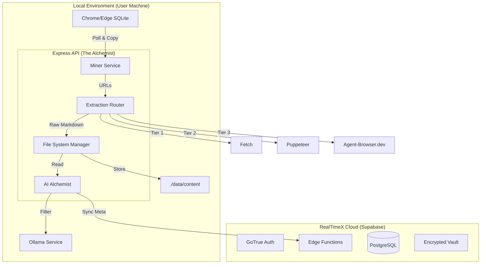

# Product Definition Reference (PDR): RealTimeX Alchemy
**Version:** 1.0.0 Request for Review
**Platform:** RealTimeX Local Apps (macOS, Windows, Linux)
**Design Pattern:** "Email Automator" Standard (Supabase Edge + Local Hybrid API)

---

# PART 1: The Product Strategy

## 1. Executive Summary
**RealTimeX Alchemy** is a "Passive Intelligence" engine that monetizes the time knowledge workers spend reading.

Unlike tools that require active bookmarking, Alchemy runs quietly in the background, mining the user's local browser history. It employs a **Tiered Extraction Engine** (utilizing `agent-browser.dev` for high-complexity sites) and a **Local LLM** to semantically filter "Signal" from "Noise." 

**Privacy is paramount:** Mining happens locally, and sensitive domains (Banking, Health, Social Admin) are blacklisted by default.

At the end of the day, Alchemy "transmutes" this raw consumption into monetizable assets—Newsletters, Market Reports, and Social Threads—without the user lifting a finger.

## 2. The Core Pivots (Key Decisions)
*   **From "Time" to "Semantics":** We do *not* rely on "Time on Page" to judge value. We rely on a Local LLM to read the content and judge its "Information Density."
*   **From "Cloud Wrapper" to "Local First":** To ensure privacy and bypass scraping blocks, the heavy lifting (mining/filtering) happens on the user's local machine via an Express API.
*   **From "Generic Scraping" to "Tiered Extraction":** We use a cost-optimized router. Free methods first; `agent-browser.dev` is the "Heavy Artillery" for paywalls/SPAs.
*   **From "Manual Review" to "Discovery Feed":** Instead of a static list, users see a real-time "Discovery Log" of AI insights as they browse.

## 3. Monetization Strategy (The Marketplace)
The app is distributed via `marketplace.realtimex.ai`.
*   **Free Tier:** Local mining (all platforms), Local LLM (Ollama), Tier 1 & 2 extraction.
*   **Pro Tier ($19/mo):** Tier 3 extraction (Agent-Browser), Hybrid LLM support (Cloud GPT-4o/Claude for high-polish writing), "Persona" customization.

---

# PART 2: Technical Architecture

## 1. System Overview
Alchemy uses a **Hybrid Architecture**:
*   **Control Plane (Cloud):** Supabase Edge Functions manage Auth, Config, and Sync.
*   **Data Plane (Local):** A Local Express API handles file system access, scraping, and AI processing.



## 2. Component Responsibilities

### A. Edge Functions (The Control Plane)
*   **Auth & Licensing:** Manages user login and validates Pro Tier status.
*   **Secret Management:** Stores `AGENT_BROWSER_API_KEY` and `OPENAI_API_KEY` in Supabase Vault.
*   **Global Blacklist:** Maintains a list of common sensitive domains (e.g., `paypal.com`, `basecamp.com`) to be synced to the local engine.
*   **Signal Registry:** Stores *metadata only* (Title, URL, Summary, Score) of processed articles. **Never stores full body text.**

### B. Express API (The Local Engine)
This is the core of the application. It consists of four distinct internal services:
1.  **The Miner (Ingestion):**
    *   **Responsibility:** Polling the local machine for knowledge consumption across macOS, Windows, and Linux.
    *   **Logic:**
        *   **System-Wide Browser Support:** Implements the `browser-history` specification to support Chrome, Firefox, Safari, Edge, Opera, and Brave.
        *   **Multi-Platform Pathing:** Dynamically locates browser profile directories based on the host OS (e.g., `~/Library/Application Support/` on macOS, `%AppData%/Local/` on Windows).
        *   **Lock Bypass:** Copies history files to `.tmp/` before querying to avoid database locks.

2.  **The Router (Tiered Extraction):**
    *   **Responsibility:** Getting the text at all costs.
    *   **Logic:**
        *   **Tier 1 (Fetch):** Try simple GET. If successful & content > 500 chars, return.
        *   **Tier 2 (Puppeteer):** If Tier 1 fails, launch headless browser. Handle simple JS rendering.
        *   **Tier 3 (Agent-Browser):** If Tier 2 fails (Paywall/SPA/Login), use `agent-browser.dev` SDK for high-fidelity extraction.

3.  **The Alchemist (Intelligence):**
    *   **Responsibility:** Filtering Signal from Noise using **Hybrid LLM Routing**.
    *   **Logic:** 
        *   **Hybrid Routing:** Like `email-automator`, it supports both Local (Ollama) and Cloud (OpenAI/Anthropic) endpoints based on user configuration and "Information Complexity."
        *   **Robust Parsing:** Implements a manual JSON extraction strategy to handle LLM output inconsistencies.
        *   **Signal Scoring:** 
            *   *Score < 50:* Trigger Librarian to delete raw content immediately.
            *   *Score > 50:* Generate Summary + Category + Entities.

4.  **The Librarian (Storage):**
    *   **Responsibility:** Managing `./data/content`.
    *   **Logic:** Saves raw markdown via UUID. Implements a **Retention Policy**: Signals with score < 70 are deleted after 48 hours; High Signals are kept for 30 days unless archived.

---

# PART 3: Detailed Logic Specifications

## 1. The "Signal Score" Prompt (Local LLM)
This is the heart of the "Passive Intelligence" model.
*   **Model:** Llama 3 (8B) or Phi-3 (via Ollama).
*   **System Prompt:**
    > "You are an expert Editor. Analyze the following article text.
    > Return a JSON object with:
    > - `score` (0-100): Based on information density, novelty, and concrete data. Penalize marketing fluff.
    > - `summary` (string): A 1-sentence gist.
    > - `category` (string): The primary topic.
    > - `entities` (array): Key companies or people mentioned.
    >
    > If the content is generic, clickbait, or navigation text, set score to 0."

## 2. The Transmuter (Output Generator)
When the user requests a "Transmutation" (Generation):
1.  **Selection:** Retrieves High-Signal items from last 24h/7d.
2.  **Synthesis:** Sends metadata + excerpts to GPT-4o.
3.  **Templates:**
    *   **Daily Alpha (Newsletter):** 3-5 bullet points of "Market Signal" with synthesis.
    *   **Growth Thread (X/LinkedIn):** A narrative thread starting with a "Hook" based on the day's densest topic.
    *   **Topic Brief (Market Report):** A focused deep-dive into a specific `category` (e.g., "AI Infrastructure").
4.  **Persistence:** Result saved to `./data/outputs/` and metadata synced to Supabase for mobile view.

## 3. Database Schema

**`signals` table**
*   `id` (uuid, PK)
*   `user_id` (uuid, FK)
*   `url` (text)
*   `title` (text)
*   `domain` (text)
*   `signal_score` (int2)
*   `summary` (text)
*   `extraction_method` (enum: 'tier1', 'tier2', 'tier3')
*   `created_at` (timestamptz)

**`personas` table**
*   `id` (uuid, PK)
*   `name` (text)
*   `system_prompt` (text)

---

# PART 4: Deployment & Setup

Adhering to the **Email Automator** pattern, we prioritize ease of setup.

## 1. The Migration Engine (`scripts/migrate.sh`)
This script bundles the logic to deploy the backend without the user touching the Supabase dashboard manually.
*   **Input:** `SUPABASE_URL`, `SUPABASE_KEY` (Anon), `SUPABASE_SERVICE_ROLE_KEY` (Optional, for Edge deploy).
*   **Actions:**
    1.  `supabase link`
    2.  `supabase db push` (Applies schema)
    3.  `supabase functions deploy`
    4.  `supabase secrets set` (Sets Agent-Browser keys)

## 2. Local Environment Setup
The local app requires a `.env` file for the Express API.
```bash
# .env
PORT=3000
SUPABASE_URL=...
SUPABASE_ANON_KEY=...
# Optional: For Tier 3 Extraction
AGENT_BROWSER_API_KEY=sk_...
# Optional: Local LLM Endpoint
OLLAMA_HOST=http://localhost:11434
```

---

# PART 5: Implementation Roadmap

## Phase 0: Foundations & Permissions
*   **Goal:** Ensure local engine can talk to browsers and LLMs across all platforms.
*   **Deliverables:**
    *   Hybrid LLM support validation (Local + Cloud).
    *   Cross-platform permission guides (macOS Full Disk Access, Windows AppData).
    *   Express API boilerplate with cross-platform SQLite bridge.

## Phase 1: Passive Mining (Ingestion)
*   **Goal:** Successfully track history and extract clean markdown.
*   **Deliverables:**
    *   `Miner` service with multi-browser support.
    *   `Router` service (Tier 1 & 2).
    *   Blacklist filtering logic.

## Phase 2: The Alchemist (Intelligence)
*   **Goal:** Local scoring and sentiment analysis.
*   **Deliverables:**
    *   Ollama integration with "Robust JSON" extraction.
    *   "Discovery Log" real-time UI component.
    *   Tier 3 (`agent-browser.dev`) integration.

## Phase 3: Transmutation (Products)
*   **Goal:** Asset generation and cloud sync.
*   **Deliverables:**
    *   Output Templates (Newsletter, Thread, Report).
    *   Supabase Persona & Signal Sync.
    *   "Transmute" Dashboard UI.

# PART 6: Design System & UX

Alchemy follows the **RealTimeX Premium** design language, emphasizing transparency and high-fidelity aesthetics.

## 1. Visual Language
*   **Theme:** Dark Mode by default.
*   **Aesthetics:** "Glassmorphism" for cards and modals. Subtle purple and gold gradients to reflect the "Alchemy" theme.
*   **Color System:** Use **OKLCH** for all tokens to ensure consistent perceptual lightness across themes.
    *   *Primary:* `oklch(65% 0.25 280)` (Deep Purple)
    *   *Accent:* `oklch(80% 0.15 85)` (Alchemy Gold)
*   **Typography:** [Outfit](https://fonts.google.com/specimen/Outfit) (Headings) and [Inter](https://fonts.google.com/specimen/Inter) (UI Text).

## 2. Core Components
*   **Live Discovery Terminal:** A scrolling, terminal-style feed (leveraging `LiveTerminal` logic) showing real-time extraction events:
    *   `[MINER] Found URL: news.ycombinator.com/item?id=...`
    *   `[ALCHEMIST] Scoring: 85 (High Signal)`
    *   `[TRANSMUTER] Added to Daily Alpha queue.`
*   **Signal Cards:** Interactive cards showing article title, domain favicon, signal score, and AI gist.
*   **The "Transmutation" Button:** A high-gloss, animated button (Framer Motion) that triggers the generation pipeline.

## 3. Sensory Feedback
*   **Sound:** Soft, synthesized chime (440Hz sinus) when a High-Signal article is "transmuted."
*   **Haptics:** Subtle feedback on primary actions (Transmute, Save, Archive).
*   **Micro-animations:** Smooth layout transitions when filtering or sorting signals.
---