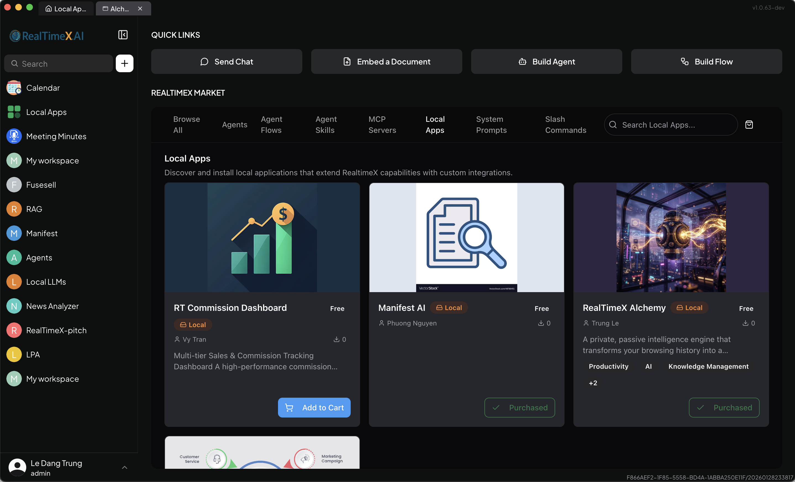

# Getting Started with RealTimeX Alchemy

This guide will walk you through the process of setting up RealTimeX Alchemy for the first time.

## 1. Installation & Desktop Integration

RealTimeX Alchemy is designed to run as a **Local App** within the **RealTimeX Desktop** environment. This integration allows Alchemy to leverage the powerful AI capabilities and Node.js environment of the Desktop app.

### Step 1: Install RealTimeX Desktop
1.  **Download and Install**: Get the RealTimeX Desktop app from [realtimex.ai](https://realtimex.ai).
2.  **Open RealTimeX Desktop**.

> [!NOTE]
> **Standalone Executable**: Alchemy now bundles its own Node.js environment. You no longer need to install Node.js separately to run the app via RealTimeX Desktop.

### Step 2: Install Alchemy from Marketplace
The easiest way to install Alchemy is through the integrated marketplace:
1.  In RealTimeX Desktop, go to the **Marketplace** tab.
2.  Search for **"Alchemy"**.
3.  Click **Purchase** (or Install).


*Figure 1: Installing Alchemy from the RealTimeX Marketplace.*

> [!TIP]
> **Manual Installation (Advanced)**: If you prefer to install via script, you can click **Add Local App** in the **Local Apps** tab and use this configuration:
> ```json
> {
>   "command": "npx",
>   "args": ["@realtimex/realtimex-alchemy@latest", "--port", "3024"]
> }
> ```
> (Note: You can change `"3024"` to any available port if needed).

> [!IMPORTANT]
> Alchemy **must** run as a local app to access the RealTimeX SDK. Standing alone via CLI is for advanced debugging only and will not have access to AI providers unless manually configured.

### Prerequisites
-   **RealTimeX Desktop**: Must be running to provide LLM and Embedding services, as well as the underlying Node.js server environment.
-   **Supabase Account**: Required for the **"Own Your Database"** privacy model.

## 2. Initial Setup

When you launch Alchemy via RealTimeX Desktop, it automatically connects to the **RealTimeX SDK**.

### Step 1: Database Connection
Enter your **Supabase URL** and **Anon Public Key**. This secure connection allows Alchemy to store and retrieve your mined signals, chat history, and embeddings.

### Step 2: Zero-Config Cloud Provisioning
If you don't have a Supabase project ready, the setup wizard now supports **Zero-Config Cloud Provisioning**:
1.  Provide your **Supabase Personal Access Token**.
2.  Alchemy will automatically create a new project, provision the database, and configure your API keys.
3.  The wizard handles DNS wait times and initial provisioning logs in real-time.


*Figure 2: Real-time provisioning logs during cloud setup.*

### Step 3: Running Migrations
The setup wizard will detect if your database needs initialization or an update.
- **New Projects**: Tables and real-time functions are set up automatically.
- **Existing Projects**: A **"Database Update Available"** banner will appear if a schema update is detected. You can run migrations directly from the app interface.

### AI Providers (Automatic)
Unlike standalone apps, you **do not need to configure API keys** (like OpenAI or Anthropic) within Alchemy. Alchemy inherits these providers directly from your **RealTimeX Desktop** settings via the SDK.

## 3. Connecting Browser Sources

Alchemy explores your browser history to find "signals".
1.  Go to the **Configuration** tab.
2.  Enable the browsers you want to mine (Chrome, Edge, Safari, Brave).
3.  Set a **"Sync From"** date. Alchemy will process history from that point forward.

## 4. Your First Sync

Click the **"Sync History"** button in the sidebar. You can monitor the **Live Terminal** to see URLs being discovered and scored in real-time by the integrated AI providers.

---

> [!TIP]
> Since AI processing is handled by RealTimeX Desktop, ensure you have a provider (like Ollama or OpenAI) configured in the **Desktop App's global settings** before starting your sync.
